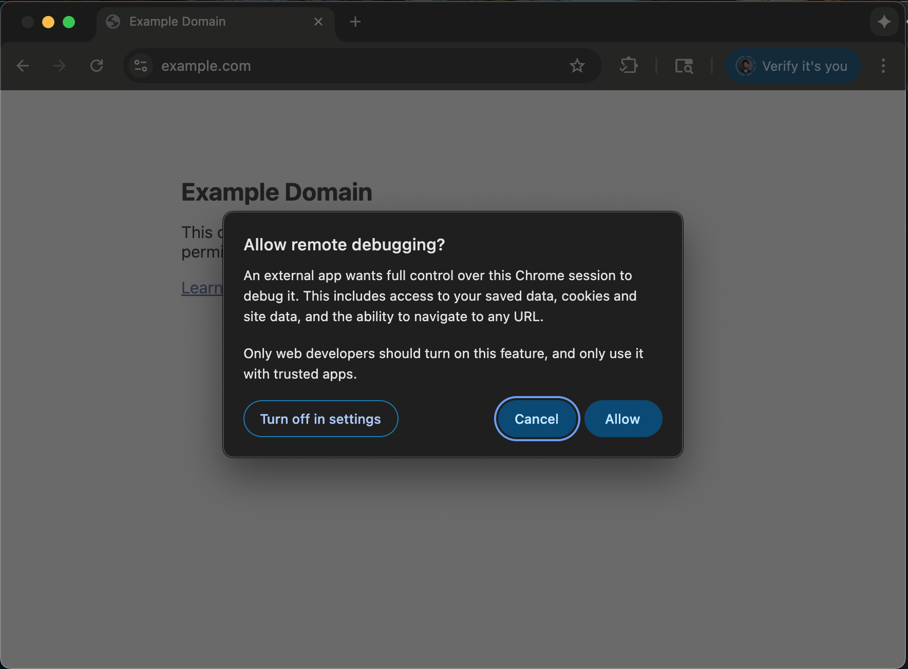

# Browser Harness ♞

Connect an LLM directly to your real browser with a thin, editable CDP harness. For browser tasks where you need **complete freedom**.

One websocket to Chrome, nothing between. The agent writes what's missing during execution. The harness improves itself every run.

Try browser-harness in [Browser Use Cloud](https://cloud.browser-use.com/v4?utm_campaign=browser-harness-use-in-cloud&utm_source=github) or paste the setup prompt into your coding agent.

```
  ● agent: wants to upload a file
  │
  ● agent-workspace/agent_helpers.py → helper missing
  │
  ● agent writes it                         agent_helpers.py
  │                                                       + custom helper
  ✓ file uploaded
```

**You will never use the browser again.**

## Setup prompt

Paste into Claude Code or Codex:

```text
Install or upgrade browser-harness to the latest stable version with uv using Python 3.12, register the skill from `browser-harness skill`, and connect it to my browser. Follow https://github.com/browser-use/browser-harness/blob/main/install.md if setup or connection fails.
```

The agent will open `chrome://inspect/#remote-debugging`. Tick the checkbox so the agent can connect to your browser:


Click Allow when the per-attach popup appears (Chrome 144+):



See [agent-workspace/domain-skills/](agent-workspace/domain-skills/) for example tasks.

## Built-in Codex agent

This worktree also exposes a self-contained Codex-backed runner:

```bash
browser-harness agent "open example.com and tell me the page title" \
  --codex-repo ../Codex-browser-harness-embed
```

For an interactive standalone UI, launch the forked Codex TUI in a prepared
browser-harness workspace:

```bash
browser-harness tui "open example.com and tell me the page title" \
  --codex-repo ../Codex-browser-harness-embed
```

It launches the forked Codex app-server from that repo, creates an isolated
browser-harness run workspace, injects the browser-harness instructions, and
makes `./bin/browser-harness` available to the agent inside that workspace. It
does not silently fall back to a system `codex` binary; build the fork first with
`cd ../Codex-browser-harness-embed/codex-rs && cargo build -p codex-cli`.

## Free Browser Use Cloud browsers

Stealth, sub-agents, or headless deployment.<br>
**Browser Use Cloud free tier: 3 concurrent browsers, proxies, captcha solving, and more. No card required.**

- Grab a key at [cloud.browser-use.com/new-api-key](https://cloud.browser-use.com/new-api-key)
- Or let the agent sign up itself via [docs.browser-use.com/llms.txt](https://docs.browser-use.com/llms.txt) (setup flow + challenge context included).

## Architecture (~1k lines across 4 core files)

- `install.md` — first-time install and browser bootstrap
- `SKILL.md` — day-to-day usage
- `src/browser_harness/` — protected core package
- `${XDG_CONFIG_HOME:-~/.config}/browser-harness/agent-workspace/agent_helpers.py` — helper code the agent edits
- `${XDG_CONFIG_HOME:-~/.config}/browser-harness/agent-workspace/domain-skills/` — reusable site-specific skills the agent edits

Plain `browser-harness` helper calls attach to the running Chrome/Chromium CDP endpoint. For isolated automation, launch Chrome yourself with `--remote-debugging-port` and pass `BU_CDP_URL`, or use a Browser Use cloud browser.

## Development

From a checkout, use `./browser-harness` to run the current working tree without activating a virtualenv or depending on the globally installed command:

```bash
./browser-harness <<'PY'
print(page_info())
PY
```

Normal agent-facing docs should keep using `browser-harness`; the `./browser-harness` launcher is only for local repo testing.

## Contributing

PRs and improvements welcome. The best way to help: **contribute a new domain skill** under [agent-workspace/domain-skills/](agent-workspace/domain-skills/) for a site or task you use often (LinkedIn outreach, ordering on Amazon, filing expenses, etc.). Each skill teaches the agent the selectors, flows, and edge cases it would otherwise have to rediscover.

- **Skills are written by the harness, not by you.** Just run your task with the agent — when it figures something non-obvious out, it files the skill itself (see [SKILL.md](SKILL.md)). Please don't hand-author skill files; agent-generated ones reflect what actually works in the browser.
- Open a PR with the generated `domain-skills/<site>/` folder copied into this repo's `agent-workspace/domain-skills/` examples — small and focused is great.
- Bug fixes, docs tweaks, and helper improvements are equally welcome.
- Browse existing skills (`github/`, `linkedin/`, `amazon/`, ...) to see the shape.

If you're not sure where to start, open an issue and we'll point you somewhere useful.

## Domain skills

Set `BH_DOMAIN_SKILLS=1` to enable domain skills from the agent workspace. This repo's [agent-workspace/domain-skills/](agent-workspace/domain-skills/) directory contains examples to contribute via PR.

---

[The Bitter Lesson of Agent Harnesses](https://browser-use.com/posts/bitter-lesson-agent-harnesses) · [Web Agents That Actually Learn](https://browser-use.com/posts/web-agents-that-actually-learn)
