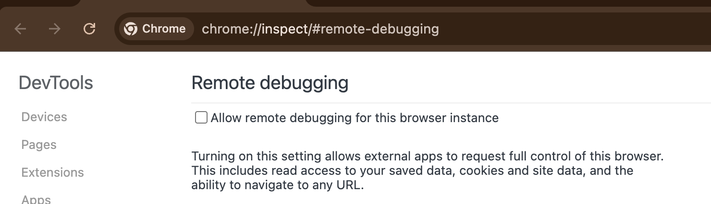

# Browser Harness ♞

The simplest, thinnest, **self-healing** harness that gives LLM **complete freedom** to complete any browser task. Built directly on CDP.

The agent writes what's missing, mid-task, inside `agent-workspace/`. No framework, no recipes, no rails. One websocket to Chrome, nothing between.

```
  ● agent: wants to upload a file
  │
  ● agent-workspace/agent_helpers.py → helper missing
  │
  ● agent writes it                         agent_helpers.py
  │                                                       + custom helper
  ✓ file uploaded
```

**You will never use the browser again.**

## Setup prompt

Paste into Claude Code or Codex:

```text
Set up https://github.com/browser-use/browser-harness for me.

Read `install.md` first to install and connect this repo to my real browser. Then read `SKILL.md` for normal usage. Use `agent-workspace/agent_helpers.py` and `agent-workspace/domain-skills/` for task-specific edits. When you open a setup or verification tab, activate it so I can see the active browser tab. After it is installed, open this repository in my browser and, if I am logged in to GitHub, ask me whether you should star it for me as a quick demo that the interaction works — only click the star if I say yes. If I am not logged in, just go to browser-use.com.
```

When this page appears, tick the checkbox so the agent can connect to your browser:



See [agent-workspace/domain-skills/](agent-workspace/domain-skills/) for example tasks.

## Free remote browsers

Useful for stealth, sub-agents, or deployment.<br>
**Free tier: 3 concurrent browsers, proxies, captcha solving, and more. No card required.**

- Grab a key at [cloud.browser-use.com/new-api-key](https://cloud.browser-use.com/new-api-key)
- Or let the agent sign up itself via [docs.browser-use.com/llms.txt](https://docs.browser-use.com/llms.txt) (setup flow + challenge context included).

## Parallel agents and `BU_NAME`

Multiple agents can use the same local Chrome if each one runs with a distinct `BU_NAME`. That isolates the harness daemon/session state, not the whole browser.

```bash
BU_NAME=alpha browser-harness -c 'new_tab("https://example.com"); print(page_info())'
BU_NAME=beta browser-harness -c 'new_tab("https://example.org"); print(page_info())'
```

What `BU_NAME` isolates:
- socket, pid, and daemon state
- attached target/session inside the harness

What it does not isolate on local Chrome:
- the visible Chrome window
- profile cookies/login state
- accidental interaction with the same site or tab flow

Use Browser Use remote browsers only when explicitly requested or when the task genuinely requires a separate cloud browser.

Remote access is opt-in per daemon. Setting `BROWSER_USE_API_KEY` or having Browser Use cloud enabled is not enough: `BU_NAME=alpha browser-harness ...` still attaches to local Chrome unless `alpha` was started with `start_remote_daemon("alpha")` or a remote `BU_CDP_WS` / `BU_CDP_URL`. When Chrome remote debugging shows `Server running at: 127.0.0.1:9222`, local daemons will prefer that local browser unless you explicitly point them elsewhere.

## How simple is it? (~592 lines of Python)

- `install.md` — first-time install and browser bootstrap
- `SKILL.md` — day-to-day usage
- `src/browser_harness/` — protected core package
- `agent-workspace/agent_helpers.py` — helper code the agent edits
- `agent-workspace/domain-skills/` — reusable site-specific skills the agent edits

## Contributing

PRs and improvements welcome. The best way to help: **contribute a new domain skill** under [agent-workspace/domain-skills/](agent-workspace/domain-skills/) for a site or task you use often (LinkedIn outreach, ordering on Amazon, filing expenses, etc.). Each skill teaches the agent the selectors, flows, and edge cases it would otherwise have to rediscover.

- **Skills are written by the harness, not by you.** Just run your task with the agent — when it figures something non-obvious out, it files the skill itself (see [SKILL.md](SKILL.md)). Please don't hand-author skill files; agent-generated ones reflect what actually works in the browser.
- Open a PR with the generated `agent-workspace/domain-skills/<site>/` folder — small and focused is great.
- Bug fixes, docs tweaks, and helper improvements are equally welcome.
- Browse existing skills (`github/`, `linkedin/`, `amazon/`, ...) to see the shape.

If you're not sure where to start, open an issue and we'll point you somewhere useful.

---

[The Bitter Lesson of Agent Harnesses](https://browser-use.com/posts/bitter-lesson-agent-harnesses) · [Web Agents That Actually Learn](https://browser-use.com/posts/web-agents-that-actually-learn)
