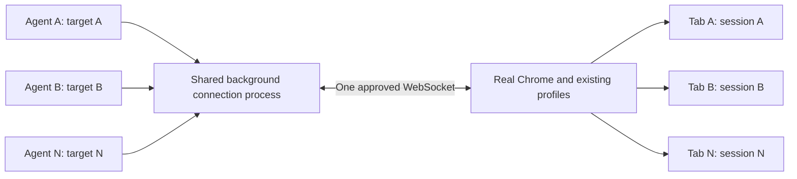

# One connection, independent tabs

## Decision

Keep the detached connection process, but stop using its mutable current tab
as the routing authority for every agent. The agent remembers a Chrome target
ID; the client sends it on each request. Chrome already multiplexes flattened
tab sessions over one WebSocket. No agent IDs, browser-wide lock, tab ownership
database, Page class, or new service installer are needed.



## Agent experience

First invocation:

```python
print(new_tab("https://example.com"))
```

Later invocations, including concurrent invocations by other agents:

```python
switch_tab("THE_RETURNED_TARGET_ID")
print(page_info())
print(capture_screenshot())
```

`switch_tab()` selects the client process's target, not Chrome's foreground tab
or the daemon's global default. `new_tab()` always creates a fresh background
tab. Screenshots get unique default filenames. Only an explicit user request
should invoke `activate_tab()`. Agents retain full raw CDP access, including
explicit session IDs for advanced iframe/Target-domain operations.

Page helpers fail with an actionable error until the process selects a target;
they do not inherit the daemon's startup tab. Existing multi-invocation scripts
must retain a target ID and select it in each invocation. `list_tabs()` and
browser-wide CDP commands remain usable without a page selection.

Attached sessions enable CDP focus emulation once so hidden pages can render
and process wheel input. This does not activate Chrome's visible tab. Agents
can disable it through raw CDP; selecting a cached session preserves their
override. Unsupported providers are logged, not replaced with another browser.
`switch_tab()` does not take an implicit recording screenshot. Explicit
screenshots and requested recordings remain available.

The same helpers module is not a per-thread context: independent CLI processes
are the supported concurrent-agent boundary. An orchestrator using one Python
process can use explicit CDP session IDs or separate worker processes.

## What is actually shared?

| Resource | Behavior |
|---|---|
| Chrome connection | One per daemon name; omit `BU_NAME` by default |
| Tab selection | Local to each CLI process; retain target ID across calls |
| CDP attachment | Cached per target, with single-flight initialization |
| Events and dialogs | Routed by target; draining A does not consume B's events |
| Clicks, typing, screenshots | Can overlap across different tab sessions |
| Same tab | Concurrent actions can still race; use separate tabs |
| Cookies/storage/profile | Shared within the relevant Chrome profile, not account isolation |
| Native foreground, browser settings, download policy | Shared browser/OS state; not independently controllable by every agent |
| Capacity | No new artificial tab cap; Chrome memory, CPU, rendering and IPC throughput still limit useful concurrency |

One WebSocket interleaves messages; it does not serialize an entire agent task.
A slow response can coexist with outstanding requests for other sessions.
Browser-global operations and browser crashes remain shared failure boundaries.
Use separate browsers for isolation, not just to get independent tab control.

Remote CDP endpoints use the same routing and single-flight startup per name.
Browser Use Cloud provisioning needs stored authentication or an API key;
arbitrary `BU_CDP_WS`/`BU_CDP_URL` endpoints have their own authentication rules.
Separate remote browsers remain opt-in for independent identities/lifetimes.

`drain_events(all_targets=True)` reads the separate connection-wide buffer,
including browser-level and independently attached raw-session events. Draining
either queue does not consume the other. These bounded buffers are not a
lossless event bus; advanced agents can filter the raw events themselves.

## Approval and connection lifetime

Chrome DevTools maintainers explicitly confirm that each WebSocket connection
requires approval, not each tab or agent. Chrome's real-session documentation
also describes per-connection consent. Sharing the connection is the supported
way to remove per-agent prompts, not a way to disable consent.
[Maintainer explanation](https://github.com/ChromeDevTools/chrome-devtools-mcp/issues/1794),
[Chrome's real-session design](https://developer.chrome.com/blog/chrome-devtools-mcp-debug-your-browser-session?hl=en).

The daemon is already detached from its initiating CLI and has no idle expiry.
Normal CLI/agent exit does not stop it. This patch also disables timed WebSocket
pings for local Chrome and preserves the shared process on an ambiguous health
timeout. Remote keepalive is unchanged. The underlying WebSocket library's
default heartbeat can otherwise terminate a connection after a late pong.
[WebSocket keepalive behavior](https://websockets.readthedocs.io/en/stable/topics/keepalive.html).

The local approval handshake already has no default deadline on main. Finite
command-response timeouts remain useful: they report a stalled operation without
expiring the connection or replaying an ambiguous mutation. An explicitly
rejected stale tab session can be reattached once to the *same* target; a closed
target is not permission to redirect work to some other tab.

Closing Chrome, killing the daemon, logout/reboot, or a real transport failure
still ends the connection. No implementation can keep a socket to a terminated
Chrome process alive. On the next connection Windows/Linux users may need one
approval, shared by all agents; macOS can use the existing narrowly scoped
`mac-approve` helper with Accessibility permission. This PR does not add a
background auto-approval watcher.

### Could we avoid even approval after Chrome restarts?

An extension is a viable alternative product direction: `chrome.debugger`
attaches to tabs through an extension permission, rather than opening the
remote-debugging WebSocket. A native-messaging bridge could reconnect after
Chrome restarts. This is an architectural inference from the documented API,
not an extension implemented or tested by this PR.

It adds per-profile extension installation, a native bridge and platform
packaging, and debugger permission/UX. The API exposes a restricted set of CDP
domains, so it is not a transparent replacement for full browser-level CDP.
For the smallest implementation, keep the shared WebSocket design first.
[Chrome debugger API](https://developer.chrome.com/docs/extensions/reference/api/debugger).

Launching the default real profile with debugging flags is not a supported
escape hatch: Chrome 136 changed port/pipe handling to require a non-default
user-data directory. A disposable automation profile changes the requested
logged-in user experience. This proposal neither copies credentials nor
weakens Chrome's security settings.
[Chrome's debugging-switch change](https://developer.chrome.com/blog/remote-debugging-port?hl=en).

## Review of related open proposals

Reviewed the relevant connection/tab UX diffs, not every unrelated open PR:

| PR | Recommendation |
|---|---|
| [#746](https://github.com/browser-use/browser-harness/pull/746) | Right core model. This proposal builds on it and fixes initialization/cancellation, lifecycle cleanup, exact raw-session routing, implicit target pinning and screenshot collisions. Seven targeted regression tests fail against its head `cbe5bc7` and pass here. |
| [#754](https://github.com/browser-use/browser-harness/pull/754) | Correct socket-leak fix; incorporated the same close-in-finally behavior, with non-destructive timeout handling. |
| [#734](https://github.com/browser-use/browser-harness/pull/734) | Do not adopt as-is. Its lock is acquired after the browser handshake, and a not-yet-listening owner can be mistaken for a stale lock. Reuse the existing pre-spawn lock, now also for remote endpoints. |
| [#748](https://github.com/browser-use/browser-harness/pull/748) | Do not automatically select a surviving tab on close. That can redirect an agent into another task. Diagnose connection health independently of the closed default tab instead. |
| [#751](https://github.com/browser-use/browser-harness/pull/751) | Do not silently choose the first URL/title substring match. Duplicate URLs are normal with many agents, and this resolver also affects closing tabs. Exact IDs are simpler and safer. |
| [#723](https://github.com/browser-use/browser-harness/pull/723) | Useful keepalive concern, but avoid its global WebSocket monkeypatch and merely longer timeout. Configure the local client directly; unrelated domain-skill changes are outside this PR. |
| [#725](https://github.com/browser-use/browser-harness/pull/725) | Automatic foregrounding for canvas screenshots conflicts with background-first UX. Rendering limitations need explicit handling, not surprise focus theft. |
| [#747](https://github.com/browser-use/browser-harness/pull/747) | Useful separate localization work. Exact title/button matching is preferable to generic Allow clicking. Its claim of working in any language is stronger than the finite tables/tests prove; validate localized Chrome before promising that. |

## Verification and rollout

- Unit coverage includes concurrent target routing, per-target dialogs/events,
  stale-session recovery, attach cancellation, buffer cleanup, health timeouts,
  target lifetime subscription, raw sessions, and unique screenshots.
- The opt-in integration test launches a disposable headless Chrome, races
  independent CLI processes from cold start, then resumes every tab in a fresh
  process for coordinate clicks, typing and pixel-verified screenshots. It also
  tests a real JS dialog and closes all targets before reusing the same daemon.
- Measured on macOS: 100 concurrent clients, 100 distinct tabs and screenshots,
  one daemon, 5.21 seconds for the synthetic workflow. This is not a benchmark
  of 100 heavy websites or proof of Windows/Linux runtime behavior.
- Real-profile smoke test: logged-in Hacker News navigation, extraction and
  screenshot succeeded. Two simultaneous CLI processes then captured separate
  tabs and clicked a synthetic page through the same daemon; the visible Chrome
  tab ID was unchanged before/after. All task-created tabs were closed afterward.

No dependency or lockfile changes. No automatic installation, release, daemon
replacement or PR merge is part of this proposal. When deploying, upgrade both
the CLI and the persistent daemon once after its active tasks finish. Existing
pre-routing daemons cannot implement new target-scoped requests, and starting
another daemon per agent is not a migration strategy.
